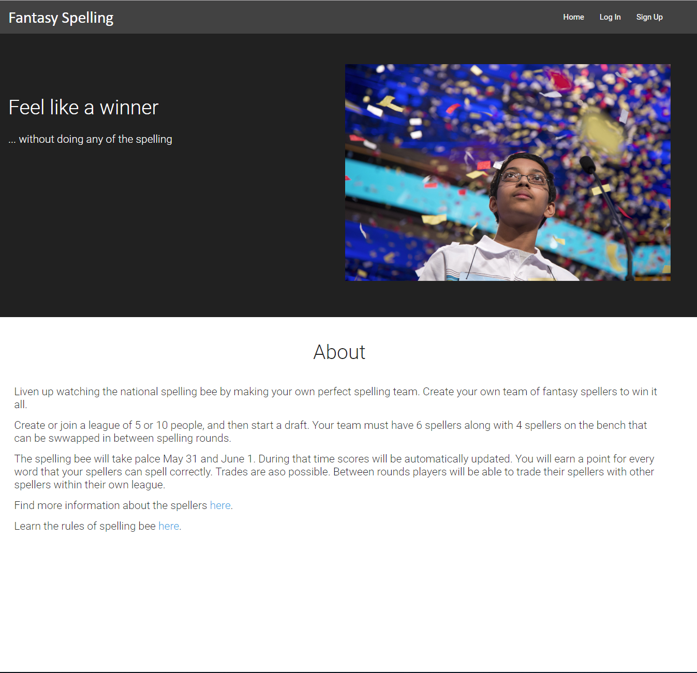
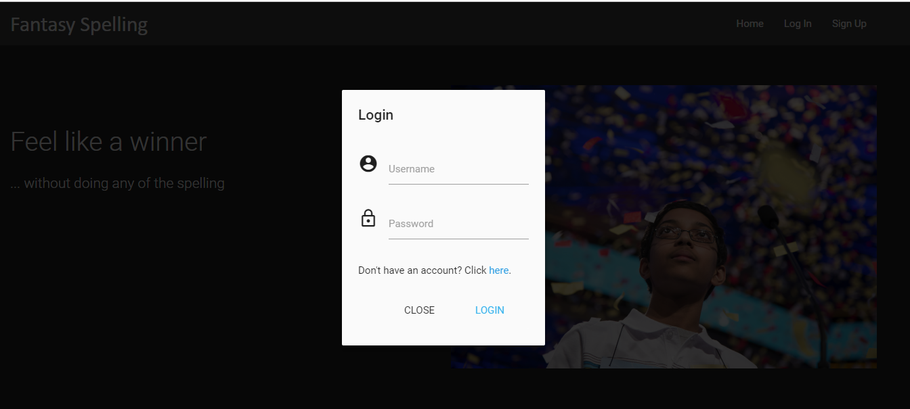
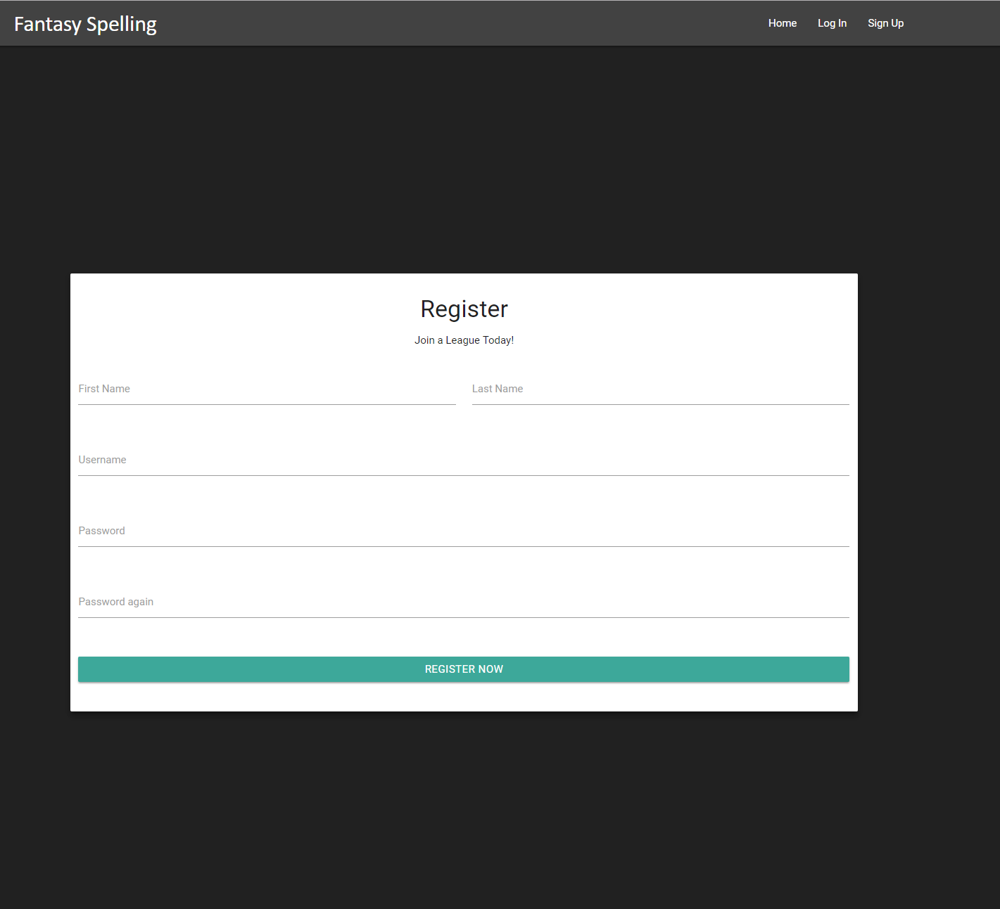
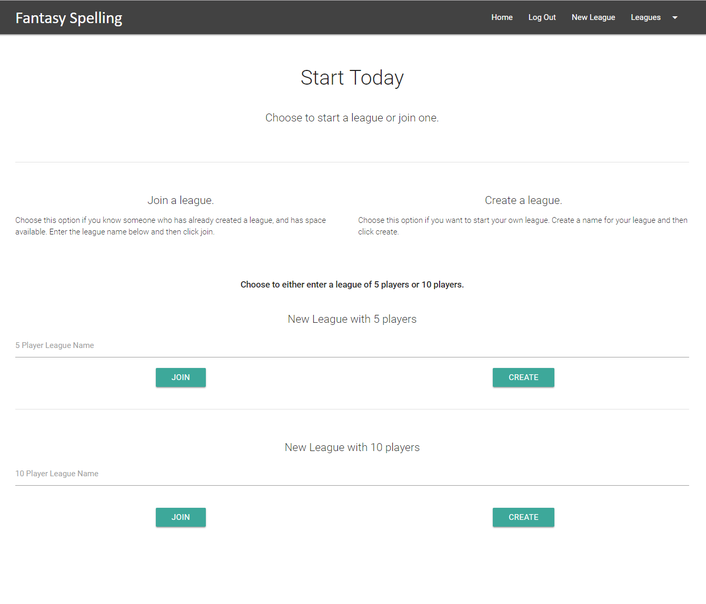
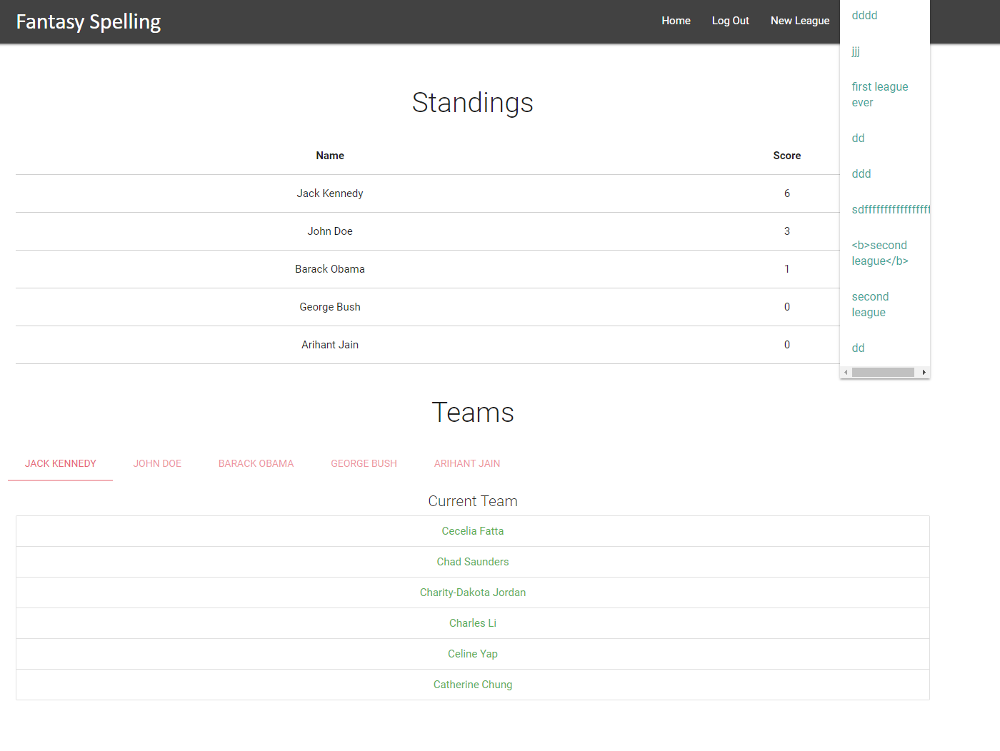
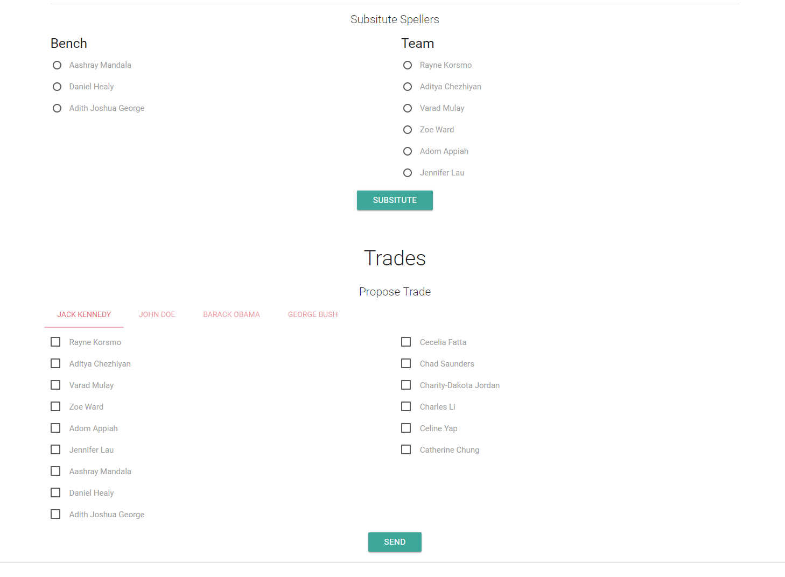

# Fantasy Spelling
A website that allowed people to compete with friends by building a team of spellers in the National spelling bee and gaining points when a member of the team would spelling something correctly

## Home without login

## Login modal

## Home with login

## Restistration page

## Join or create a league

## Multiple leagues

## Inactive league

## Active League

