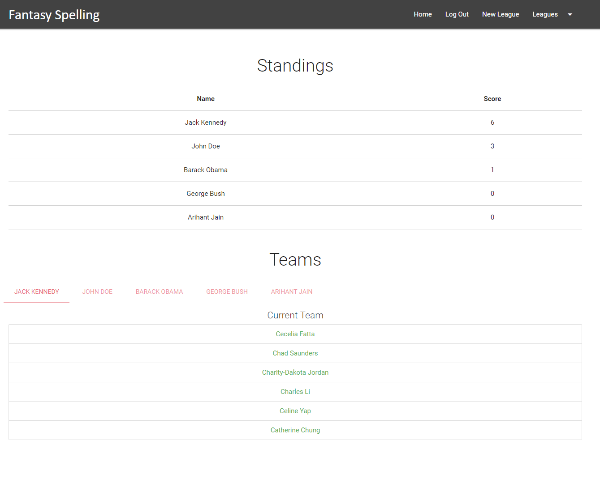
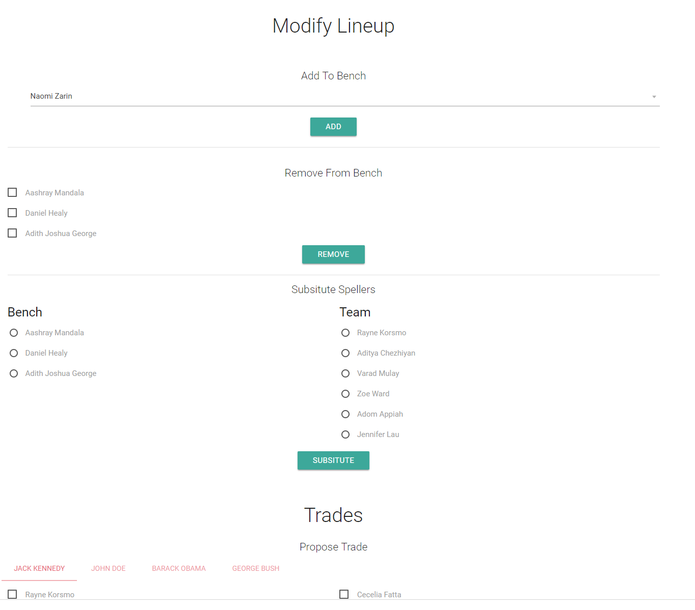

# Fantasy Spelling
A website that allowed people to compete with friends by building a team of spellers in the National spelling bee and gaining points when a member of the team would spelling something correctly

I built this website in ny junior year of high school as a side project to learn web development. The idea was to take the concept of fantasy football and apply to a sport that was less popular. The sport that was chosen was the spelling bee. 
The National Spelling Bee is a competition that is held every year in May/June between the tope 300 spellers in the country. Competitors must not have completed middle school. 
The website uses PHP, jquery, and mySQL. It uses materialize for the visuals. To get real time spelling info, it uses the stream twitter api to watch the official twitter account's tweets. 
Users can join multiple leagues of 5 or 10 people. They can add, dropp, and trade spellers while a spelling round is not going on. They can see a realtime score of everyone in the league.

## Home without login

## Login modal

## Home with login

## Restistration page

## Join or create a league

## Multiple leagues

## Inactive league

## Active League

